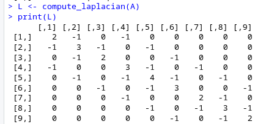
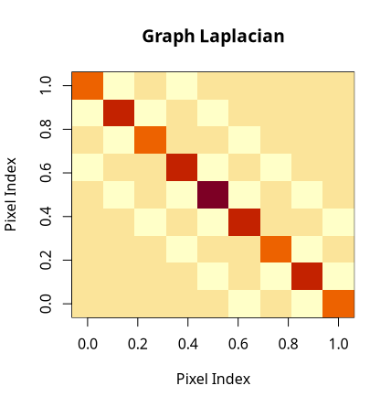
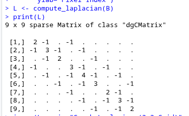
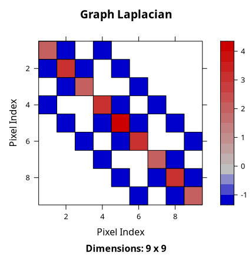

# Easy Task

## Overview
1. To install and load the hyperSpec package in R. 
2. Load the flu or laser dataset. 
3. To construct a simple pixel adjacency matrix from a 2D spatial grid and calculate and compute its graph Laplacian.
4. Plot the results.

## Solution
For computing the adjacency matrix 2 different methods were used:

1.**Using manual construction in `create_adjacency`:** Builds the adjacency matrix of a 2D grid using 4-neighbour connectivity (up, down, left, right). It maps each grid position (r,c) to a unique node index and initializes an 
N×N zero matrix. For every pixel, it checks valid neighbouring positions and sets the corresponding entries in the matrix to 1.

2. **Using `gridadjacencymatrix` from spatstat.sparse:** Automatically generates a sparse adjacency matrix.

Both approaches produce the same graph structure.

To find the graph laplacianthis equation is used: \
`L=D−A` \
where
A = adjacency matrix, D = diagonal degree matrix.

## Results
1. For matrix A (dense type from create_adjacency): \
 \
 \

2. For matrix B (sparse type from gridadjacencymatrix): \
 \
