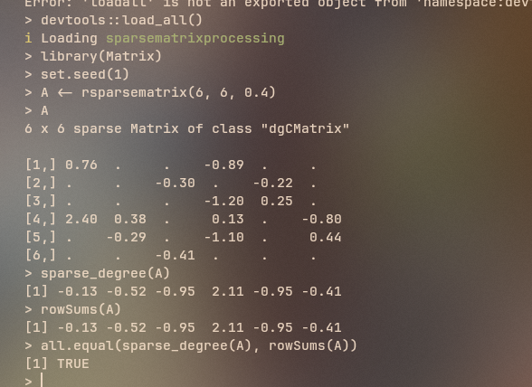

# Hard Task

## Overview
1. To extract the i, p, and x slots from an R dgCMatrix sparse matrix via extendr.
2. Wrap them as Rust slices and construct a faer sparse matrix.
3. Return the degree vector (row sums) to R using extendr's WritableSlice to avoid an unnecessary allocation.
4. Verify using the pure-R result.

## Solution

I have created a R package for this. Refer to the code in `sparsematrixprocessing/src/rust/src/lib.rs`. 

Using extendr, the R object is converted to an S4 object and its slots are then accessed: \
@i → row indices \
@p → column pointers \
@x → values \
@Dim → matrix dimensions \
These vectors already represent the CSC structure, so no restructuring is needed. The integer indices are converted to usize for compatibility with Rust and faer.

The extracted vectors are wrapped as Rust slices. A slice is simply a view (pointer + length), so this introduces no additional allocation. Then a sparse matrix is constructed using i, x and p. It creates a typed view representing:
` A = CSC(p,i,x)` \
The row sums are computed directly using the CSC structure.\
For each column j: `for k∈[p[j],p[j+1]) : di[k]+=x[k] ` \
This correctly implements: `di=∑jAij`

The output vector is allocated directly in R memory. This uses a writable slice into R’s memory.

The correctness of the solution is verified using:
```
library(Matrix)
library(sparsematrixprocessing)

set.seed(1)
A <- rsparsematrix(6, 6, 0.4)
all.equal(sparse_degree(A), rowSums(A))
```

It gives `TRUE` as both sparse_degree(A) (our function) and rowSums(A) give the same results.

## Results
Verification results \


**Note:** You can also install the package easily by downloading [sparsematrixprocessing_0.0.0.9000.tar.gz](https://github.com/shinigami-777/hyperSpec-Tasks/blob/main/hard_task/sparsematrixprocessing_0.0.0.9000.tar.gz).\
Use the package using:
```
install.packages("sparsematrixprocessing_0.0.0.9000.tar.gz", repos = NULL, type = "source")
library(sparsematrixprocessing)
```