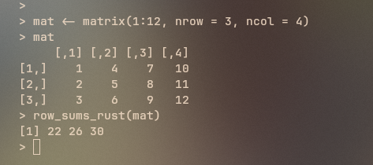
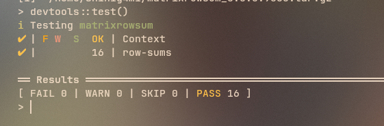

# Medium Task

## Overview
1. To create a minimal R package using extendr.
2. Pass a dense matrix from R to Rust, compute its row sums in Rust using faer, and return the result to R.
3. Include a test.

## Solution

Refer to the code in `matrixrowsum/src/rust/src/lib.rs`. \
The function `row_sums_rust` takes an R matrix and computes its row sums in Rust. \
First, it gets the number of rows and columns. It reads all values column by column (because R stores matrices in column-major order) and stores them in a Rust vector.\
Next, it creates a `faer::Mat` matrix from that data. It then loops over each row, adds all values in that row, and stores the sum in a result vector. \
Finally, it returns the row sums back to R as a numeric vector.

The testfile is given inside `matrixrowsum/tests/testthat/test-row-sums.R`. The tests are run using the `testthat` package.

To compile and use the package run the following steps in R (after having the matrixrowsum folder):
```
library(rextendr)
library(usethis)
library(devtools)

setwd("matrixrowsum")
rextendr::document()
devtools::load_all()
```

Test with a simple matrix:
```
mat <- matrix(1:12, nrow = 3, ncol = 4)
print(mat)
row_sums_rust(mat)
```

To run the tests:
```
devtools::test()
```

## Results

With a simple matrix: \


Test results: \


**Note:** You can also install the package easily by downloading **[matrixrowsum_0.0.0.9000.tar.gz](https://github.com/shinigami-777/hyperSpec-Tasks/blob/main/medium_task/matrixrowsum_0.0.0.9000.tar.gz).** \
Use the package using:
```
install.packages("matrixrowsum_0.0.0.9000.tar.gz", repos = NULL, type = "source")
library(matrixrowsum)
```
